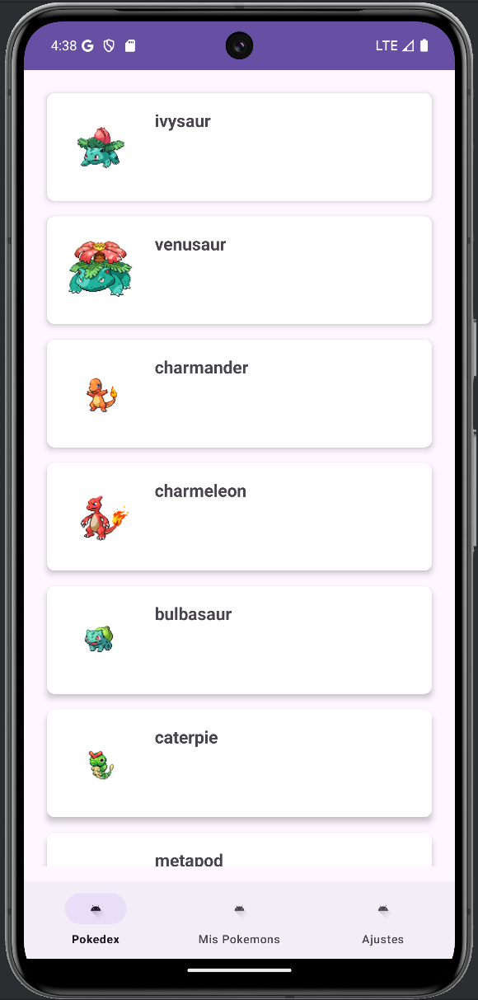
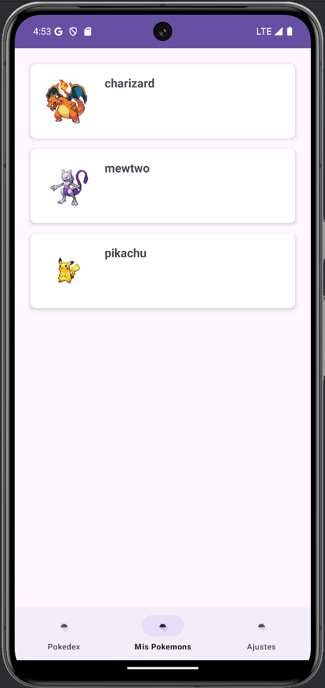

# PokemonApp

 

## Introducción

**PokemonApp** es una aplicación diseñada para los aficionados a Pokémon. En ella puedes explorar una Pokédex con los primeros 101 Pokémon, capturar tus favoritos y gestionar tu colección personal. Además, la aplicación ofrece ajustes personalizables para una experiencia adaptada a tus preferencias.

## Características principales

- **Pokédex interactiva**: Explora los primeros 101 Pokémon obtenidos de la [PokeAPI](https://pokeapi.co/). Puedes ver detalles y capturarlos para agregarlos a tu colección personal.
- **Gestión de Pokémon capturados**: Visualiza y administra tu lista de Pokémon capturados en la sección "Mis Pokémon". Los datos se almacenan de manera segura en Firestore.
- **Ajustes personalizables**: Cambia el idioma de la aplicación y habilita la opción de eliminar Pokémon de tu colección.
- **Interfaz moderna y fluida**: Diseñada con componentes visuales atractivos y una experiencia de usuario optimizada.

## Tecnologías utilizadas

PokemonApp se ha desarrollado utilizando tecnologías y herramientas modernas, entre las que se incluyen:

- **Android SDK**: Base del desarrollo de la aplicación.
- **Java**: Lenguaje de programación principal.
- **Firestore**: Base de datos en tiempo real para almacenar los Pokémon capturados.
- **Retrofit**: Cliente HTTP para consumir la API de Pokémon.
- **RecyclerView**: Para mostrar listas dinámicas, como la Pokédex y la lista de Pokémon capturados.
- **PokeAPI**: Fuente de datos para obtener información de los Pokémon.
- **SharedPreferences**: Gestión de configuraciones personalizadas (idioma y ajustes).

## Instrucciones de uso

### Requisitos previos

- Android Studio (versión más reciente).
- Conexión a internet para acceder a la PokeAPI y Firestore.
- Cuenta de Firebase configurada con Firestore habilitado.

### Pasos para ejecutar la aplicación

1. Clona este repositorio en tu máquina local:
   
   `"https://github.com/tuusuario/PokemonApp.git"`

2. Abre el proyecto en Android Studio.
3. Configura Firebase en tu proyecto:
   - Descarga el archivo google-services.json desde la consola de Firebase.
   - Colócalo en la carpeta app del proyecto.
4. Instala las dependencias necesarias sincronizando el proyecto con Gradle.
5. Ejecuta la aplicación en un dispositivo físico o emulador.

## Conclusiones del desarrollador

Desarrollar esta app ha sido de gran ayuda para aprender conceptos clave a la hora de interactuar con APIs y bases de datos en la nube como Firestore. Durante el proceso, aprendí a integrar Retrofit para el consumo de APIs y Firestore para el almacenamiento de datos.

Lo mas dificil fue la sincronización entre la Pokédex y la base de datos, especialmente al gestionar la eliminación y actualización de Pokémon capturados.
